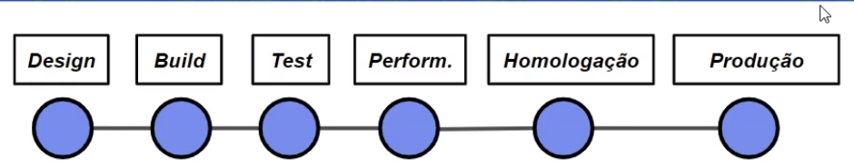
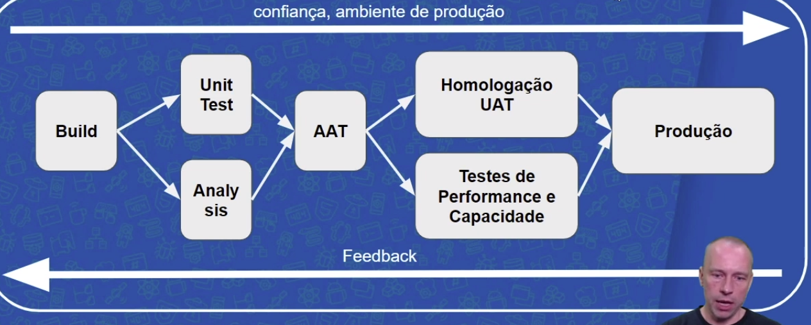

"Our highest priority is to satisfy the customer through early and continuous delivery os valuable software"

A entrega continua envolve outras áreas da tecnologia, uma deles é DevOps.

### Dicas
* Feedback contínua
* Melhoria contínua
* Aprendizagem contínua

Livros:
Continuous Delivery - Jez Humble
The DevOps Handbook

## Pipeline de deploy

AntiPattern:

* Gerenciamento manual de ambientes
	Resultado: Deploy não confiável
	Regra: Todos os ambientes são tratados como código, versionado e criados de maneira automatizada.

* Deploy manual
	Resultado: Deploy lento, propício ao erro, não confiável.
	Regra: Duas tarefas devem ser executadas manualmente:
		1. Escolher a versão do release.
		2. Click no "deploy button"

* Deploy apenas no fim do ciclo
	Resultado: Poucoa colaboração, Problemas só aparecem no dia da publicação, não confiável nem rápido, *achismo*.
	Regra: Deployment faz parte do desenvolvimento desde a primeira iteração, todos definem um delivery team.

# PRINCÍPIOS DE ENTREGA CONTINUA

"Entregar software com alta qualidade e grande valor de maneira eficiente, rápido e confiável"

I. Automatize.
II. Versione.
III. Repita.
IV. Garanta qualidade.
V. Defina "done".
VI. Cria delivery
VII. Usa melhoria contínua.

## Elementos da Entrega Contínua

* Cultura DevOps
	- feedback, colaboração, confiança.
	- melhoria e aprendizagem contínua.

* Patterns
	- deployment pipeline
	- deploy patterns (blue/gree, canary, feature toggle ...)

* Arquitetura
	- novas Propiedades: testability, deployability
	- SOLID, Services, 12 Factor App

## Pipeline 
O pipeline representa o processo que você usa na empresa.

