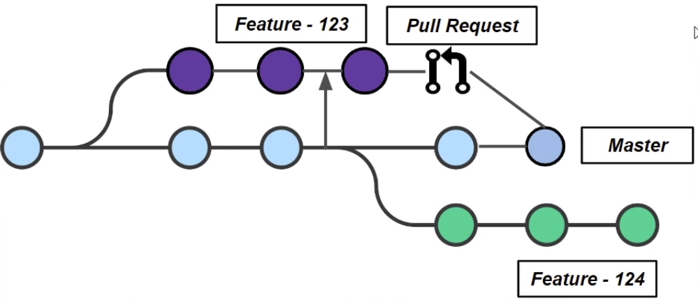

# INTEGRAÇÃO CONTINUA

Teach Nico Steppat


Continuous Integration (CI) is a development practice that require developers to integrate code into a shared repository several times a day.

ThoughtWorks

- Ferramentas não importa
- Commit tudo necessário para construção do projeto
  - código,
  - scripts,
  - migrações, schemas,
  - IDES Configs
- NÃO comitar o que pode ser construído (gem, jar, image, modules)
- clone e começar (deve ser fácil)

## ORGANIZAÇÃO DOS REPOSITÓRIOS

Multi-repo
Mono-repo
Meta-repo

## Branching Models / Strategy / Policy


## Branching Models

Git flow
Github flow
Trunk Based Development
Gitlab flow
Pull request flow
Feature branch flow
One flow

"Everyone Commits To the Mainline Every Day" - Martin Fowler

- Commits simples e lançáveis, orientado às tarefas.
- Branches atrasam integração, seguram o código.
- Branches de vida curta -> merges mais simples.
- Muitos branches, mais burocracia.
- Estratégias devem ser combinadas pela equipe.

### Branchings Models

- Temporários (branches locais)
- Features Branches: para implementar alguma funcionalidade ou tarefa.
- Historical Branches(Master e Develop)
- Environment Branches (Staging e Production)
- Maintenance Branches (Release e Hotfix)

### Trunk-Based Development


"Trunk-Based Development is a branching model that reduces this distance (between branches) to the minimum."
https://trunkbaseddevelopment.com/

### Feature Branch Workflow (Master + Feature Branches)




pull = é um pedido para nosso commit entrar no Master

[Github Flow](https://guides.github.com/introduction/flow/) (Master + Feature Branch + Pull Request)

### Gitlab Flow (Feature Branch + Pull Request +ENV Branches)


### Git Flow (Feature Branches + Pull Request + Maintenance Branches + Historical Branches)


https://danielkummer.github.io/git-flow-cheatsheet/index.pt_BR.html

### Branching Models


### Como evitar branches de vida longa?

https://martinfowler.com/bliki/BranchByAbstraction.html
https://martinfowler.com/bliki/FeatureToggle.html

Feature Flags e Branch by Abstraction

## FEATURE FLAG


## BRANCH BY ABSTRACTION


Precisamos introduzir uma abstração para isolar completamente.


## Como sincronizar branches?

## INICIO


## GI MERGE


```
git merge
```

Ele une o commit _Feature - 123_ com a _Master_

## GIT REBASE


- Cria novos commits
- Permite mater o historico linear em uma branch diferente.


- Dessa forma, nossa branch 123 está com o mesmo histórico que a master, e podemos descartá-la.

## SELF TESTING

Testes automatizados

- Testes fazem parrte da construção
- Rodar antes do commit
- TDD pode ajudar
- Desempenho importa

### Test Driven Development


### Testes automatizados


## ETAPAS DO BUILD

Se nós queremos fazer uma integração continua, nós devemos tratar de automatizar tudo que pudermos, pois nos ajuda a economizar tempo.


Tudo deveria ser possivel executando um comando só...
- Build a cada commit
- Tudo automatizado/single commands
- Build sem depender da IDE
- Tudo está no repositório

**Build rápidos/Feedback rápido**

- Otimize o build, métricas ajudam:
	- Verifique a fase testes e analise do código.
	- Verifique ordem dessas fases
	- Verifique a infra dessas fases
	- Use cache
- Use staged build/pipeline (light build, heavey build)
- Regra: "TEN- Minute Build"


## Corrija builds quebrados imediatamente

"Nobody has a higher priority task than fixing the build"
-- Kent Beck


## Manifesto Ágil

"Working software over comprehensive documentation"

"Our highest priority is to satisfy the customer through early and continuous delivery of valuable software."


**Fontes usadas**

- Livro: Continuous Integration, de Paul M. Duvall
- Artigo da ThoughtWorks: Continuous integration
- Artigo do Martin Fowler: Continuous Delivery
- Série de artigos da Caelum:
- Branches e integração contínua: o problema de feature branches
- Integração Contínua - Builds rápidos com Grids e paralelismo
- Integração contínua: deploys e aprovações sem dor de cabeça para o cliente
- Artigo no CodeBetter: Check in Dance
